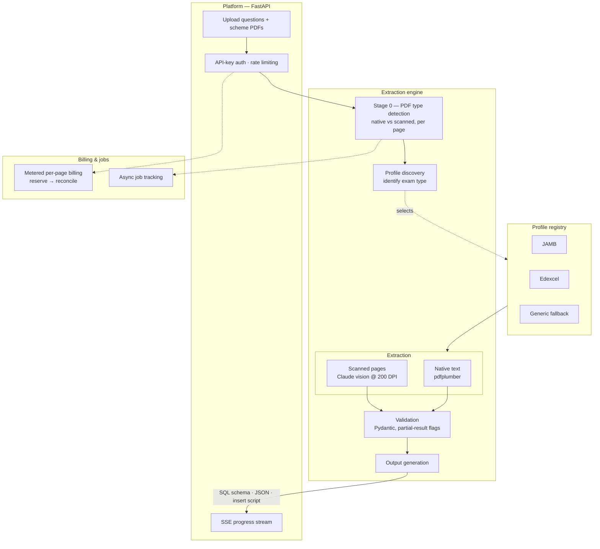

# Rubeeq

**An AI-powered engine that converts unstructured exam PDFs into structured, database-ready data.**

> **Proprietary software.** Source is visible for review purposes only.
> See [LICENSE](./LICENSE.md) for terms.

---

## What it does

Feed Rubeeq a questions paper and its marking scheme — from any exam board, in any
layout — and it returns three artefacts: a **SQL schema**, a **JSON data bundle**, and
a **ready-to-run insert script**. It handles both native and scanned PDFs, identifies
the exam type automatically, and extracts questions, mark allocations, and marking
schemes with their structure intact.

The hard part isn't reading a PDF — it's that every exam board formats papers
differently, half of them are scanned images, and the output has to be clean enough to
load straight into a database. Rubeeq is built around those three problems.

---

## How it works



The pipeline runs in stages, each validated before the next begins:

1. **Detect** — every page is classified native or scanned, so the engine only pays for vision extraction where it's actually needed.
2. **Discover** — the document is matched to a profile (JAMB, Edexcel, …) or routed to a generic fallback that never hard-fails on an unknown format.
3. **Extract** — native pages are read with pdfplumber; scanned pages go to a Claude vision model rendered at 200 DPI. Questions, marks, and scheme entries are pulled out per the profile's rules.
4. **Validate** — every stage boundary is a Pydantic schema. Bad or ambiguous data is *flagged on the record*, not allowed to propagate silently or crash the run.
5. **Generate** — the validated data is emitted as a SQL schema, a JSON bundle, and an insert script.

---

## Design decisions

The parts that took the most thought:

- **Pay for vision only when you have to.** Per-page native/scanned detection means a mostly-native paper isn't billed or slowed by running every page through a vision model. Cost and latency track the document, not the page count.
- **A profile system, not a pile of if-statements.** Each exam board is a plugin implementing a common `ExamProfile` contract (discover questions → extract → validate). Adding a new board is a new file, not a rewrite — and an unknown board still produces output via the generic profile instead of failing.
- **Flag, don't fail.** Extraction from real-world scans is never 100%. Rubeeq validates at every boundary and marks low-confidence or malformed records rather than aborting the whole job — so a 200-question paper with three bad pages still returns 197 good questions plus three flags.
- **A platform around the engine.** The engine is wrapped by a service layer: API-key authentication, rate limiting, metered per-page billing (reserve credits up front, reconcile against actual usage), async job tracking, and a Server-Sent-Events stream so callers watch progress live instead of blocking on a long request.

---

## The stack

| Layer | Technology |
|---|---|
| Extraction | Python · pdfplumber · Claude vision (Anthropic SDK) |
| Validation | Pydantic |
| API | FastAPI · SSE (sse-starlette) · SlowAPI rate limiting |
| Storage / data | Supabase · asyncpg |
| Frontend | Dash |
| Tests | pytest |

---

## Where to read the code

Since the licence is source-visible (not runnable by third parties), the best way to
evaluate Rubeeq is to read it:

- [`engine/pipeline.py`](engine/pipeline.py) — the stage orchestration
- [`engine/base_profile.py`](engine/base_profile.py) — the profile contract every exam board implements
- [`engine/profiles/`](engine/profiles/) — concrete profiles (JAMB, Edexcel) and the generic fallback
- [`engine/vision_extractor.py`](engine/vision_extractor.py) — scanned-page extraction
- [`extractor_platform/billing.py`](extractor_platform/billing.py) — the metered billing model
- [`tests/`](tests/) — schema, billing, and pipeline-logger tests

---

## Testing

```bash
python3 -m pytest tests/ -v
```

Covers billing arithmetic (reservation and reconciliation), schema validation, and
the pipeline logger.
